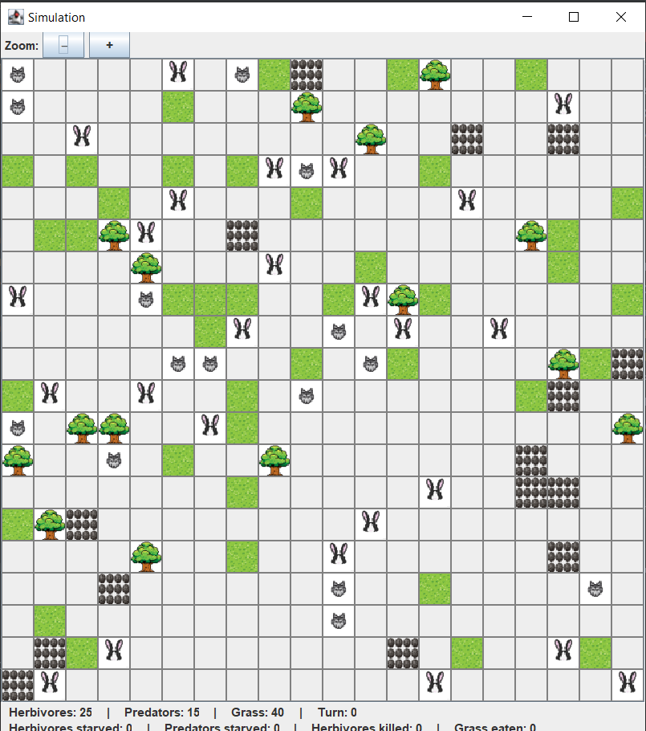
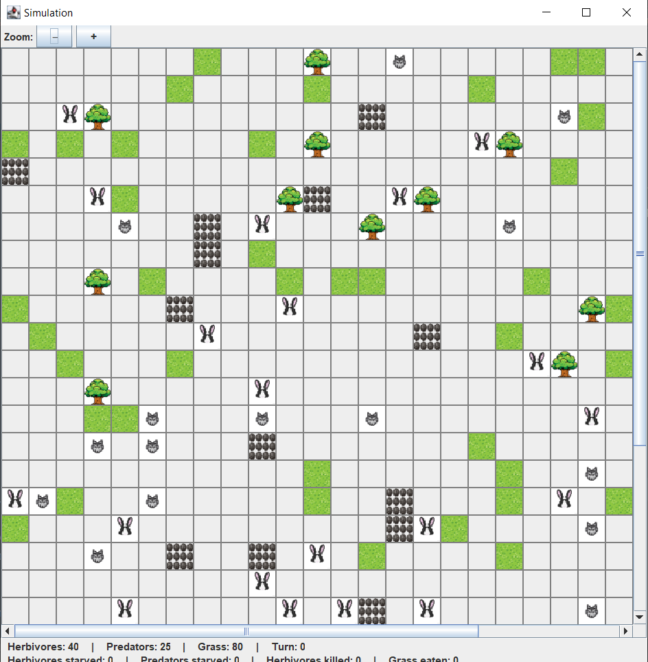

<h1 align="center"> Симуляция (console + Swing) </h1>

Травоядные - питаются травой (она постепенно растет), хищники - травоядными.

Помимо неподвижных объектов: камней, деревьев, есть двое видов существ - это травоядные и хищники.
Травоядные - питаются травой (она постепенно растет), хищники - травоядными.

---

## Содержание

- Требования, чтобы запустить проект
- Быстрый старт
- Управление
- Настройки при старте
- Логи
- Скриншоты.

<details>
  <summary>Некоторые заметки по механике симуляции, которые позволят вам лучше понять заложенные правила.</summary>

- Все существа движутся по карте к своим целям по кратчайшему маршруту (сейчас используется алгоритм поиска в ширину), минуя непроходимые объекты (могут быть статические и нет).

- Приоритет у травоядных вблизи - всегда убежать: т.е. если оно встретило хищника (1 клетка от травоядного) от себя, оно не будет даже стремиться к траве.

- У всех животных, будь то хищник или травоядное, постепенно уменьшается здоровье (оно голодает) и если здоровье = 0, животное умирает.

- Все животные имеют случайные скорость, здоровье и очки передвижения.

- Поскольку в контексте игры травоядные более уязвимы, у них скорость более стабильна (от 2 до 4 против 1 до 4 у хищников).

- Травоядные улучшают здоровье съедая траву (питательная ценность коей случайна, но выверена) и "толстеют".

- При 1 атаке не всегда хищник может убить травоядное за ход.

- Когда трава съедена или животное умерло (любым путем) - оно снимается с карты.

- Трава также имеет особенность регенерировать (случайно возникатаь на карте) до определенного капа.

_О том как симуляцию запустить, как все это дело выглядит - можно увидеть ниже, но проще скачать и поиграться (:_

---

</details>

<details>
  <summary>Требования, чтобы запустить проект</summary>

- Java 17+
- (Опционально) Maven 3.8+
- (Желательно) среда разработки, например IDEA

---

</details>


<details>
  <summary>Быстрый старт</summary>

### Вариант A — Запуск из IDE (стабильный запуск)

0. Проект расположен https://github.com/timk01/Simulation
1. Скачайте его тем или иным способом: как архив или - склонируйте (SSH/HTTPS)
2. Откройте проект в IntelliJ IDEA / Eclipse / другой IDE
3. Запустите класс **`org.simulation.Simulation`**
4. В консоли следуйте подсказкам (см. ниже).

---

### Вариант B — Сборка и запуск **толстого JAR** (uber-jar) - в случае проблем используйте вариант А выше.

1) Убедитесь, что в `pom.xml` подключён *maven-shade-plugin*
   (в текущем - уже все "под ключ", ничего дополнительно делать не нужно).
2) Соберите и запустите (берутся базовые настройки):
```bash
mvn -q -DskipTests package
java -jar target/*-shaded.jar
```
либо:  
Запуск JAR (вариант №1 — UTF‑8):
```bash
java -Dsim.console.encoding=UTF-8 -jar target/*-shaded.jar
```
либо:  
Запуск JAR (вариант №2 — Windows‑1251):
```bash
java -Dsim.console.encoding=windows-1251 -jar target/*-shaded.jar
```
### Если запускаете из IDE (IntelliJ IDEA)
1. Откройте **Run/Debug Configurations** → вашу конфигурацию запуска.
2. В поле **VM options** добавьте **ровно один** из вариантов:
   - `-Dsim.console.encoding=UTF-8`
   - `-Dsim.console.encoding=windows-1251`
3. Запускайте обычной «зелёной кнопкой».

**Если ни 1 из способов сборки В не работает - вернитесь к способу А.**

ИЛИ если у вас ~~внезапно~~ несколько у вас несколько shaded-джаров, укажите точное имя файла, например:
```bash
java -jar target/Simulation-1.0-SNAPSHOT-shaded.jar
```

---

</details>


<details>
  <summary>Управление</summary>

### старт симуляции

Вначале вы выбираете, начать ли симуляцию (повторяемо для новой симуляции, если не наскучила/попробовать еще)
- **д** — ведет к выбору пресетов
- **н** — немедленно завершает симуляцию

### выбор пресетов ("Паков" настроек)

Здесь мы выбираем карту + настройки (по принципу все включено):
- **1** — маленькая *(12×12)*
- **2** — средняя (дефолт) *(20×20, по умолчанию)*
- **3** — большая *(30×30)*
- **ентер/пробел** — карта и животный мир по-умолчанию

### выбор паузы между ходами и количетсвом ходов (по умолчанию 3 секунды//бесконечное)

- **д** — ведет к возможности выбора
- **н** — нет (дефолт)

-- если да, можно выбрать цифрами паузы/ходы, если нет - см. управление

### далее

--- как только мы выбрали настройки, вы увидите справа панель симуляции (со всеми объектами и интераактивной статистикой)
--- симуляцией можно интерактивно управлять с помощью клавиш ниже

### управление (русская раскладка WASD) -

- **ф** — пауза
- **ы** — продолжить (пока не будет пауза/выход)
- **в** — сделать ровно один ход
- **ц** — выход (корректно остановить симуляцию и выйти к самому началу)

---

</details>


<details>
  <summary>Настройки при старте</summary>

- Пресет карты: `1` — маленькая (12×12), `2` — средняя (20×20), `3` — большая (30×30)
- Задержка между ходами (порядка `3` сек)
- Лимит ходов (`0` — бесконечно)

---

</details>


<details>
  <summary>Логи</summary>

Подробные логи и финальный отчёт: можно посмотреть здесь: `logs/simulation.log`.
Как правило, если вам мало статистики в визуальном оформлении - смотрите строчку *==== SIMULATION REPORT ====*
(или, более детальные логи выше по файлу)

Уровни логирования настраиваются через `src/main/resources/logback.xml`.

</details>


<details>
  <summary>Скриншоты.</summary>

### Начальные пресеты






### Уменьшенный (кнопки +-) большой пресет


### Конец симуляции (10 ходов, средняя карта)


### Логи


</details>
